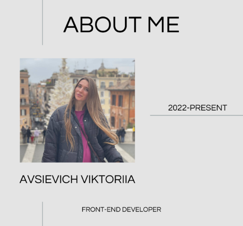

# 👋 Hi!

Passionate front-end developer with 2 years of experience. I love creating dynamic web applications and tackling complex tasks.

## 🚀 Current Projects

**Real Estate Marketplace**  
_Next.js, React, TypeScript, Redux ToolKit, Node.js, Directus, GraphQL, HTML, CSS, Tailwind, Postgresql, Keen-slider, Figma_  
Developing a comprehensive platform for property listings in Batumi, Georgia.  
[Check it out!](https://batumi.estate)

**Avsievich Marketing Agency**  
_Next.js, React, TypeScript, Strapi, Cloudinary, Node.js, GraphQL, Framer Motion, Keen-slider, HTML, CSS, Postgresql, SQlite, Vercel, Render.com_  
The project features a visually stunning design, exceptional performance, and advanced SEO optimization, ensuring an engaging user experience and high search engine visibility.
[Check it out!](https://www.avsievich.eu)

## 🛠️ Skills

## 💼 Experience

**Avsievich Marketing Agency, Frontend Developer**  
_July 2024 - Present_

The application is created for a marketing agency from the scratch.
The project features a visually stunning design, exceptional performance, and advanced SEO optimization, ensuring an engaging user experience and high search engine visibility.

**Batumi Estate, Key Frontend Developer**  
_Jun 2023 - Present_

Real Estate Marketplace in Georgia’s comprehensive marketplace platform tailored for the market with user-friendly interface, robust backend management and high performance.

**Baltic-Soft, Lead Frontend Developer**  
_Dec 2022 - Dec 2023_

The project involves the comprehensive development of a public alert system that includes both voice and digital notify cations.
The development process encompasses a wide range of tasks to ensure the system is robust, reliable, and user-friendly..

## 📚 Education

- **MSc in Nanoelectronics:** Electrotechnical University "LETI"
- **BSc in Electronics and Nanoelectronics:** Ural Federal University
- **BSc in Economy and Management:** Ural Federal University

## 🌐 Connect with Me

- **Email:** [avsievich.viktoriia@gmail.com](mailto:avsievich.viktoriia@gmail.com)
- **LinkedIn:** [linkedin.com/in/viktoriia-avsievich-4b3876267](https://linkedin.com/in/viktoriia-avsievich-4b3876267)
- **Telegram:** [@viktoriya_000001](https://t.me/viktoriya_000001)
- **Phone:** [+48-739-011-244 (Mobile)](tel:+48739011244)

---

Let's build something amazing together!
